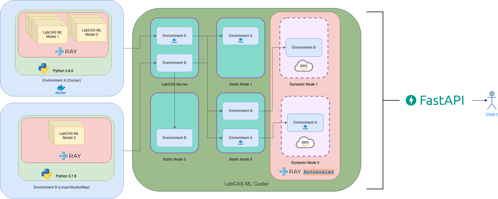

# 🧠 LabCAS ML Service β

This is the LabCAS Machine Learning Service, currently supporting Alphan Altinok's Nuclei Detection model.


## 🛠️ Development and Local Use

To build and run the LabCAS ML Service locally, clone this `git` repository and run the following commands:

```console
$ docker image build --tag labcas-ml-serve .
$ env EDRN_IMAGE_OWNER= docker compose up
```

👉 **Note:** On some systems, `docker compose` is `docker-compose`.

The following endpoints will be available:

-   http://localhost:8080/alphan/ — ReST API for predicting and training the model
    -   http://localhost:8080/alphan/docs — Interactive documentation where you can try out the ReST API
    -   https://localhost:9443/alphan/docs — Same, but over https
-   http://localhost:8080/results/ — ReST API for checking on task status or retrieving completed nuclei detection
    -   http://localhost:8080/results/docs — Interactive documentation for the above
    -   https://localhost:9443/results/docs — Same, but over https
-   http://localhost:8265/ — Ray's Dashboard
-   gcs://localhost:6378/ — Ray "Global Control Server" port

👉 **Note:** The `https` endpoints use a self-signed certificate.

You can stop the composed processes by hitting your interrupt key (typically ⌃C). The `outputs` directory created in the host environment will contain model outputs should you need to diagnose issues.

Don't forget to remake the `labcas-ml-serve` image with `docker image build` as you make changes to the source code.


### 🚢 Publishing to the Docker Hub

Once you have a working system, tag it with a version number and publish it to the Docker Hub:

```console
$ docker image tag labcas-ml-serve nutjob4life/labcas-ml-serve:1.2.3
$ docker image push nutjob4life/labcas-ml-serve:1.2.3
```


### 🌱 Environment Variables

The following table lists the environment variables used by the LabCAS ML Service's composition:

| Variable Name             | Use                                                       | Default                    |
|:--------------------------|:----------------------------------------------------------|:---------------------------|
| `EDRN_IMAGE_OWNER`        | Name of image owning org.; empty string for a local image | `nutjob4life/`             |
| `EDRN_ML_SERVE_VERSION`   | Version of the LabCAS ML Serve image to use               | `latest`                   |
| `PWD`                     | Current working directory for model `outputs`             | The current directory      |
| `EDRN_RAY_SERVE_PORT`     | GCS port for Ray Serve                                    | 6378                       |
| `EDRN_RAY_DASHBOARD_PORT` | Ray Dashboard port                                        | 8265                       |
| `EDRN_HTTP_PORT`          | HTTP ReST API                                             | 8080                       |
| `EDRN_TLS_PORT`           | HTTPS ReST API                                            | 9443                       |
| `CERT_CN`                 | Common name (hostname) for the self-signed cert for TLS   | `edrn-docker.jpl.nasa.gov` |


## 🚀 Deployment at JPL

To deploy this into production at the NASA Jet Propulsion Laboratory, first publish an official version-tagged image to the Docker Hub (described above). Then copy the `docker-compose.yaml` file to the appropriate location on `edrn-docker`. Add a `@reboot` entry in the system's crontab to run

    env EDRN_ML_SERVE_VERSION=X.Y.Z EDRN_HTTP_PORT=9080 docker compose up --quiet-pull --remove-orphans --detach

replacing `X.Y.Z` with the blessed version.

Next, inform the system administrators to set up a reverse-proxy so that

    https://edrn-labcas.jpl.nasa.gov/mlserve/ → https://edrn-docker:9443/

This endpoint should be behind an HTTP Basic auth challenge that uses `ldaps://edrn-ds.jpl.nasa.gov/dc=edrn,dc=jpl,dc=nasa,dc=gov?uid?one?(objectClass=edrnPerson)` as the AuthLDAPURL

You can test for success by checking that these URLs:

-   https://edrn-labcas.jpl.nasa.gov/mlserve/alphan/predict should return 405, method not allowed
-   https://edrn-labcas.jpl.nasa.gov/mlserve/alphan/train should return 200 OK and the payload `null`
-   https://edrn-labcas.jpl.nasa.gov/mlserve/results/get_results should return 422, unprocessable entity
-   https://edrn-labcas.jpl.nasa.gov/mlserve/results/task_status should also return 422, unprocessable entity


### 🏃 Model Runs

Once the official deployment at JPL is complete (see above), you can then submit your own model runs. For example, to submit an image and receive a task ID, try:

    curl --basic --user 'USERNAME:PASSWORD' \
        --request POST \
        --header 'Accept: application/json' \
        --header 'Content-type: multipart/form-data' \
        --form 'input_image=@IMAGE-FILE-PATH;type=image/png' \
        'https://edrn-labcas.jpl.nasa.gov/mlserve/alphan/predict?model_name=unet_default&is_extract_regionprops=True&window=128'

Replace `USERNAME` with your EDRN username, and `PASSWORD` with your password. Replace `IMAGE-FILE-PATH` with the image file you wish to process. You can also change the model name, extract region from true to false, and the window size. You'll receive back a task ID.

Once the model's run, you can use that task ID to get the results. For example:

    curl --basic --user 'USERNAME:PASSWORD' \
        --request GET --header 'Accept: application/json' --output output.zip \
        'https://edrn.jpl.nasa.gov/mlserve/results/get_results?task_id=TASK-ID'

replace `TASK-ID` with the task ID received from the previous `curl` command.


## 🏛️ Architecture




### 👥 Contributing

You can start by looking at the [open issues](https://github.com/EDRN/labcas-ml-serve/issues), forking the project, and submitting a pull request.


### 🔢 Versioning

We use the [SemVer](https://semver.org/) philosophy for versioning this software.


## 📃 License

The project is licensed under the [Apache version 2](LICENSE.md) license.
